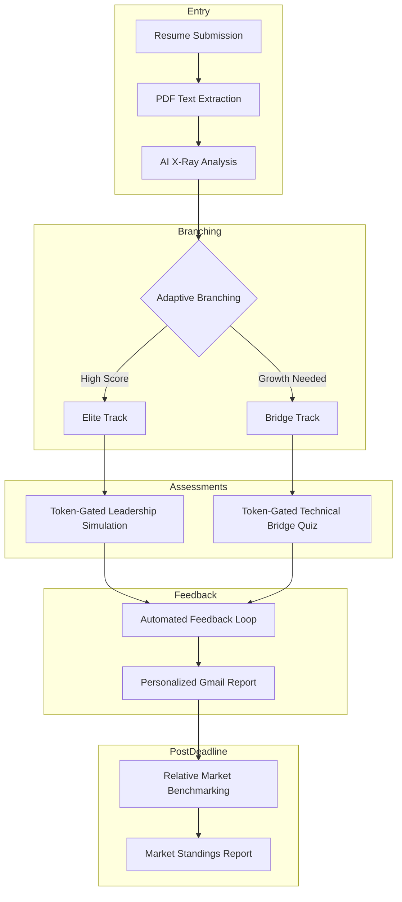
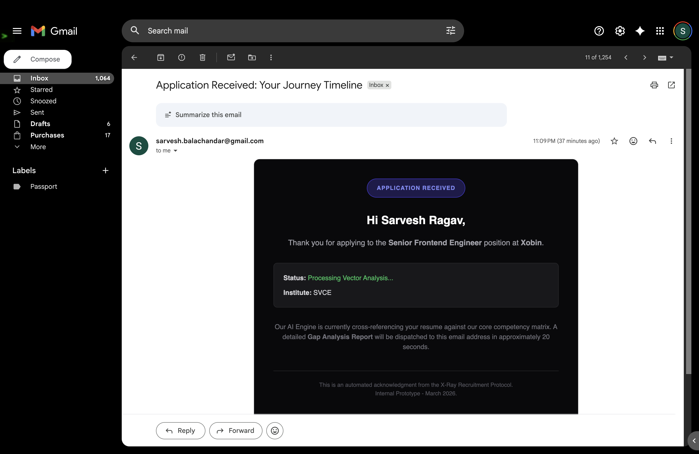

# 🚀 The X-Ray Candidate Portal: Humanizing the Recruitment Journey

| Link | URL |
|------|-----|
| **Live Deployment** | [https://xobin-candidate-portal-pilot.vercel.app](https://xobin-candidate-portal-pilot.vercel.app) |
| **GitHub** | [Repository](https://github.com/your-org/xobin-candidate-portal-pilot) |

---

> **ATS systems are built for recruiters; X-Ray is built for candidates.**

Most recruitment portals optimize for HR efficiency. Candidates submit resumes and disappear into a black hole—no feedback, no clarity, no path forward. The experience is transactional at best, demoralizing at worst.

X-Ray replaces silence with **transparency** and **growth**. Every candidate leaves the process with something of value, not just a binary yes or no.

---

## The Humanity-First Strategy

### Immediate ROI for Candidates

**Every applicant receives a Personalized Skill Gap Analysis within 20 seconds.**

No more waiting weeks for a generic rejection. The AI X-Ray analyzes the resume against the job description, surfaces alignment and gaps, and delivers actionable feedback—instantly.

### "No" is Not "Not Yet"

> **Candidates who don't match today aren't rejected; they're redirected.**

Instead of a dead end, they receive:

- **A Roadmap** — What to learn, in what order, to close the gap
- **A Bridge Assessment** — Token-gated MCQs that prove competency or identify areas to strengthen
- **A Growth Path** — Clear next steps so they can return stronger

The goal: candidates walk away informed, empowered, and with a clear trajectory—whether they get the job or not.

---

## Architectural Flow



---

## Technical Architecture

### The Orchestration Engine: Visualizing the logic branches and AI integration

The Adaptive Branching logic—Elite vs. Bridge track, AI X-Ray scoring, and feedback routing—is **not hard-coded in the frontend**. Instead, n8n manages the entire flow as a visual workflow: resume ingestion, Gemini analysis, conditional branching, and Gmail dispatch. This keeps the candidate experience human-centric while the orchestration stays flexible and maintainable.



## Feature Deep-Dive

### 1. Live System Log

A real-time terminal-style UI showing the AI "handshake"—when the resume is received, when analysis begins, when feedback is dispatched. This reduces candidate anxiety by making the process **visible** instead of opaque.

### 2. Adaptive MCQ Engine

Token-gated `/assessment` routes serve the right experience:

| Track | Route | Audience |
|-------|-------|----------|
| **Elite** | `/assessment?type=tech` or `?type=behavioral` | Senior candidates — Leadership & Pressure Simulation |
| **Bridge** | `/assessment?type=gap` | Growth candidates — Technical Gap Mitigation Quiz |

The system routes candidates based on AI X-Ray scores, ensuring everyone gets an assessment that matches their profile. These are real-time touchpoints—candidates see their path immediately and stay engaged instead of waiting in the dark.

**The Secure Assessment: Token-Gated Assessment UI**

*Add your Token-Gated Assessment UI screenshot here:*

<!--  -->

```

```

### 3. Automated Feedback Loop

**Automated Career Intelligence: Delivering instant value to the candidate's inbox**

Sophisticated HTML emails via n8n + Gmail deliver:

- **Score breakdowns** — How they performed vs. the JD
- **Percentile standings** — Where they rank in the applicant pool
- **Personalized recommendations** — What to improve

All within ~20 seconds of submission. These emails are human-centric touchpoints—designed to keep candidates engaged and informed at every step, not left wondering what happened to their application.

*Add your Elite Email and Growth Roadmap Email screenshots here:*

<!--  -->
<!--  -->

```


   Caption: Real-time career intelligence—instant value delivered to the candidate's inbox.
```

### 4. Relative Market Benchmarking

After the application deadline, candidates receive a **Market Standings** report—how they compared to the full cohort. This turns a competitive process into a learning opportunity.

---

## Technical Stack

| Layer | Technology |
|-------|------------|
| **Frontend** | Next.js 14 (App Router), React 19, Tailwind CSS, Framer Motion |
| **Orchestration** | n8n — Complex logic branching, webhooks, Gmail integration |
| **Intelligence** | Gemini Flash — Vectorized resume-to-JD analysis |
| **Deployment** | Vercel |

---

## Future Scope

- **AI Voice Interviewing** — Conversational assessments with real-time sentiment and competency scoring
- **Recruiter Heatmaps** — Visual dashboards showing candidate fit, pipeline health, and bottleneck analysis
- **Direct Xobin Module Integration** — Native embedding into Xobin's assessment ecosystem

---

## Constraint Transparency

This is a **High-Fidelity Prototype** running on **Free-Tier API Infrastructure**.

- **Rate limits and quotas** apply to all external services
- **Simulation Note** — During high-latency periods (e.g., AI processing), the n8n workflow may introduce intentional delays (~20 seconds). In production, this would be optimized with streaming, caching, or dedicated inference endpoints.

---

## Getting Started

```bash
npm install
npm run dev
```

Open [http://localhost:3000](http://localhost:3000) to access the portal.

### Environment Variables

| Variable | Description |
|----------|-------------|
| `NEXT_PUBLIC_N8N_WEBHOOK_URL` | n8n webhook URL for application submission (required for form → AI pipeline) |

Copy `.env.example` to `.env.local` and add your values.

**Webhook not configured?** See [docs/WEBHOOK_SETUP.md](docs/WEBHOOK_SETUP.md) for step-by-step setup. Import the included workflow (`docs/n8n-xobin-webhook-workflow.json`) into n8n, activate it, and copy the Production URL to `.env.local`.

---

## Deploy on Vercel

1. Import the repo into [Vercel](https://vercel.com)
2. Add `NEXT_PUBLIC_N8N_WEBHOOK_URL` in Project Settings → Environment Variables
3. Deploy

---

## Project Structure

```
docs/
├── n8n-xobin-webhook-workflow.json   # Import into n8n for webhook trigger
├── WEBHOOK_SETUP.md                  # Webhook configuration guide
└── screenshots/                      # Add n8n, email, assessment screenshots
src/
├── app/
│   ├── page.tsx              # Home: Apply with AI X-Ray
│   ├── assessment/
│   │   └── page.tsx          # Adaptive MCQs (Gap / Tech)
│   └── api/
│       ├── parse/            # PDF text extraction
│       └── parse-pdf/        # PDF text extraction (alias)
├── components/
│   ├── ApplicationEntry.tsx  # Main application form
│   └── assessment/
│       ├── SkillBridgeQuiz.tsx       # Bridge Track
│       └── LeadershipPressureQuiz.tsx # Elite Track
```

---

## Quick Links

| Link | URL |
|------|-----|
| **Live Deployment** | [https://xobin-candidate-portal-pilot.vercel.app](https://xobin-candidate-portal-pilot.vercel.app) |
| **GitHub** | [Repository](https://github.com/your-org/xobin-candidate-portal-pilot) |

---

*Built for the Xobin Technical Exercise. Human-first recruitment, one candidate at a time.*
